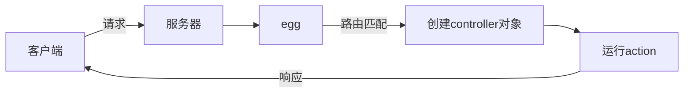
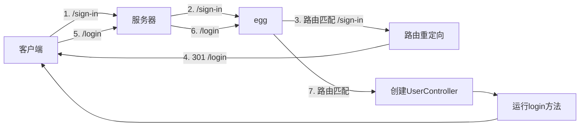

# 路由匹配

路由是一个桥梁，它连接了**请求**和**请求处理函数**

## 普通路由设置

```js
// app/router.js
// app对象是全局对象，跨越所有请求，它在egg启动后就会创建
module.exports = app => {
  // app.router：通过 new Router 创建的路由对象
  // app.controller: 根据 app/controller 文件夹中的文件创建的对象
  const { router, controller } = app; 
  router.get('/user/:id', controller.user.info);
  // 或 
  // router.get('/user/:id', "user.info");
};
```

配置路由时，可以给路由取一个合适的名称，该名称在将来可能会有用

```js
router.get("userdetail", "/user/:id", "user.info");
```

## 重定向

```js
router.get("/login", "user.login");
router.redirect("/sign-in", "/login");
```




## 路由映射过多？

`app/router.js`是集中用于映射路由的模块，不建议把它的代码分散的其他地方

可以参考下面的做法：

```js
const mapper = {};
mapper.mapUser = function (app){
  const {router} = app;
  const prefix = "/api/user";
  router.post(`${prefix}/login`, "user.login");
  router.post(`${prefix}/reg`, "user.reg");
  router.get(`${prefix}/:id`, "user.info");
  // ...
}

mapper.mapNews = function (app){
  const {router} = app;
  const prefix = "/api/news";
  router.get(`${prefix}/`, "news.all");
  router.get(`${prefix}/:id`, "news.one");
  // ...
}

module.exports = app => {
  Object.values(mapper).forEach(m=>m(app));
}
```

## 控制器在子目录？

假设控制器在`app/controller/user/auth`

```js
router.get("/user/login", "user.auth.login")
router.get("/user/login", controller.user.auth.login)
```

## RESTful 风格的 URL 定义

`router`提供了`resources`函数，用于定义`RESTful`风格的`api接口`

```js
// blogs: RESTful风格对应的资源名称
// /api/blog: 基础路径
// controller
router.resources('blogs', '/b', controller.blog);
```

上面一句代码的结果类似于：

```js
router.get("blogs", "/b", controller.blog.index); // 获取所有博客 或 分页获取博客
router.get("new_blog", "/b/new", controller.blog.new); // 获取添加博客的表单页面
router.get("blog", "/b/:id", controller.blog.show); // 获取某一篇博客
router.get("edit_blog", "/b/:id/edit", controller.blog.edit); // 获取某一篇博客的编辑界面
router.post("blogs", "/b", controller.blog.create); // 添加一篇博客
router.put("blog", "/b/:id", controller.blog.update); // 修改一篇博客
router.delete("blog", "/b/:id", controller.blog.destroy); // 删除一篇博客
```

如果我们不需要其中的某几个方法，可以不用在 `blog.js` 里面实现，这样对应 URL 路径也不会注册到 Router。


# Controller 和 action

网站中有很多的资源，比如`用户`、`文章`、`评论`

大部分情况下，对某个资源的处理，就对应一个`Controller`

在`egg`中，对`Controller`的要求如下：

- 必须写到`app/controller`文件夹中
- 基类继承自`Controller`的类（非必须，但建议这么做）
- 文件名就是`Controller`的名称

当匹配到某个`Controller`，同时匹配到某个`action`时，`egg`会：

1. 创建`Controller`实例
2. 调用对应的`action`方法


## ctx的获取

`Koa`的`context`对象可以通过以下两种途径获取：

- `action`的参数
- `this.ctx`，`controller`实例中包含`context`对象


## 下一个中间件？

在`MVC`的结构中，`controller`不应该关心其他中间件的执行

因此，在整个洋葱模型中，`controller`应该处于洋葱的最里层

所以，`egg`没有把`next`函数给予`controller`


