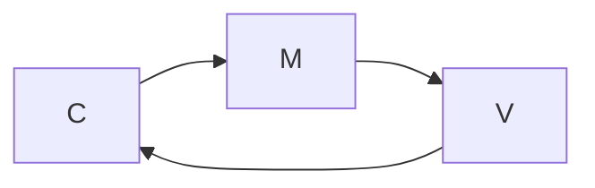
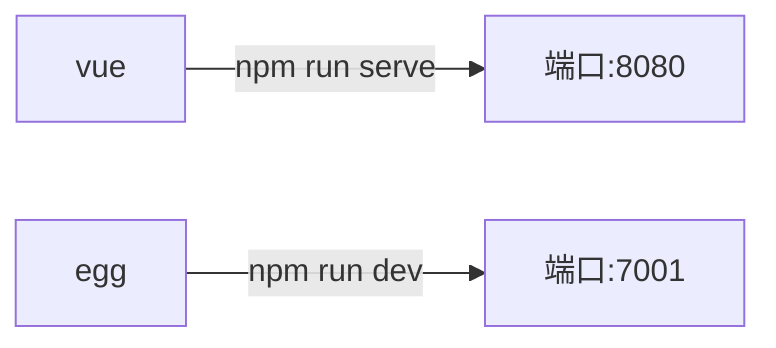

> mermaid: https://mermaidjs.github.io/#/




# 工程目录参考

```shell
|- app # egg 代码
|- client # vue 代码
|- config # egg 配置
```


# 开发阶段

各自运行即可



为了方便启动，可以对`egg`的`package.json`稍作改动：

```json
{
  "scripts": {
    "dev": "npm run dev:egg & npm run dev:vue",
    "dev:egg": "egg-bin dev",
    "dev:vue": "cd client && npm run serve",
  }
}
```


# 部署阶段

部署后，需要让`egg`服务器承载对单页应用的访问，因此有两个问题要解决：

1. 如何把`vue`的打包结果放到`egg`服务器中

   我们可以把`vue`的打包结果当做是静态资源，放到`egg`的`app/public`目录中即可

   ```js
   // client/vue.config.js
   const path = require("path");
   module.exports = {
     // 选项...
     outputDir: path.resolve(__dirname, "../app/public"),
     devServer: {
       proxy: {
         '/api': {
           target: 'http://127.0.0.1:7001'
         }
       }
     }
   };
   ```

   由于默认情况下，`egg`对静态资源的访问有前缀`/public`，为了避免差异，可以去掉该前缀

   ```js
   // config/config.default.js
   exports.static = {
     prefix: "/",
   };
   ```

   同时，设置`/package.json`中的命令：

   ```js
   "scripts": {
     "build": "cd client && npm run build"
   },
   ```

   这样，在根目录中运行`npm run build`即可打包`vue`到`app/public`中

2. 如何实现，访问任何地址都定向到单个页面

   这一点其实很简单，仅需配置视图目录和路由即可

   ```js
   // config/config.default.js 
   exports.view = { 
     root: [ 
       path.resolve(__dirname, "../app/public"),
       path.resolve(__dirname, "../app/view"),
     ].join(","), // 将 app/public 目录作为模板目录
     // 其他配置
   };
   ```

   ```js
   // app/router.js
   module.exports = (app) => {
     const { router } = app;
     // 针对 api 的配置（略）
   	// 若上面无法匹配到api，即匹配到 home.index
     router.all("*", "home.index")
   };
   ```

   ```js
   // app/controller/home
   const Controller = require("egg").Controller;
   
   module.exports = class extends Controller {
     async index() {
       await this.ctx.render("index.html"); // 渲染 index.html 模板
     }
   };
   ```

   