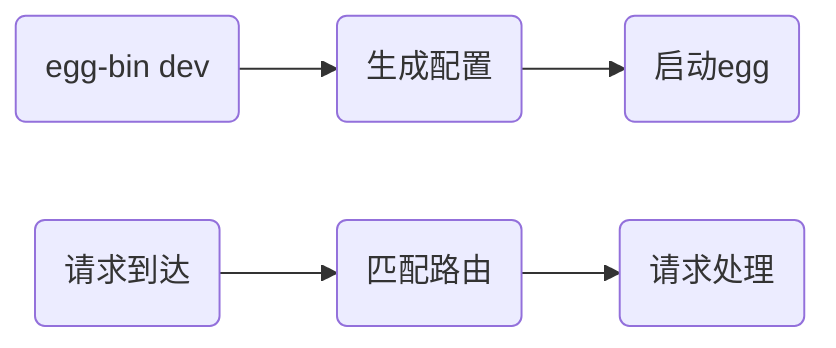

# Egg概述

仅使用基础库的工程：


使用Egg的工程：


可见Egg的特点：

- 整合了后端技术，提供一站式开发体验
- 制定了一套规范，统一了开发模式
- 提供了各种插件，具备灵活的扩展能力

除此之外，Egg还具有以下特点：

- Convention Over Configuration，约定优于配置
- 内置多进程管理
- 使用MVC模式


Egg的应用场景：任何前端服务器都可以使用Egg，如常见的：

- 中间服务器
- 纯后端服务器


# Hello World

官网：https://eggjs.org/zh-cn/index.html

## 使用Egg搭建工程

方式1： 使用 egg 脚手架

方式2： 手动搭建

```shell
npm i egg # 安装egg核心库
npm i -D egg-bin # 安装egg命令行工具
```

## 编写代码

目录结构：

```bash
root
├── app  # 应用程序目录，几乎所有核心代码都在此目录
│   ├── controller  # 控制器目录，每个控制器用于处理请求
│   │   └── home.js  # 某个控制器
│   └── router.js # 路由设置，将请求路径、方法映射到控制器
├── config # 配置目录
│   └── config.default.js # 默认配置
└── package.json
```


```js
// app/controller/home.js
const Controller = require('egg').Controller;

class HomeController extends Controller {
  async index() {
    this.ctx.body = 'Hello world';
  }
}

module.exports = HomeController;
```

```js
// app/router.js
module.exports = app => {
  const { router, controller } = app;
  router.get('/', controller.home.index);
};
```

```js
// config/config.default.js
exports.keys = <此处改为你自己的 Cookie 安全字符串>;
```

添加 `npm scripts` 到 `package.json`：

```json
{
  "scripts": {
    "dev": "egg-bin dev"
  }
}
```

## 运行

```shell
npm run dev
```

访问：http://localhost:7001


# 核心概念

## 约定

Egg中使用了很多约定，包括对文件夹的约定、对文件名的约定等等，这些约定的存在，减少了大量的配置

## 运行流程



- 生成配置：egg会在启动时读取`config`文件夹中的配置，以及`app/router.js`中的路由信息，然后将最终的配置生成到`run`文件夹中
- 启动egg：egg会在内部创建`Koa`实例，并作出适当的初始化工作，然后监听`7001`端口（默认）
- 匹配路由：egg在内部使用了`@koa/router`，会根据路由表中请求的路径和方法，把请求交给指定的`action`进行处理
- 请求处理：egg遵循`MVC`模式，**请求始终是交给`Controller`中的`Action`进行处理**
  - `Controller`表现为一个类，继承自`egg`中的`Controller`
  - `Action`表现为一个`Controller`中的实例方法，用于处理请求