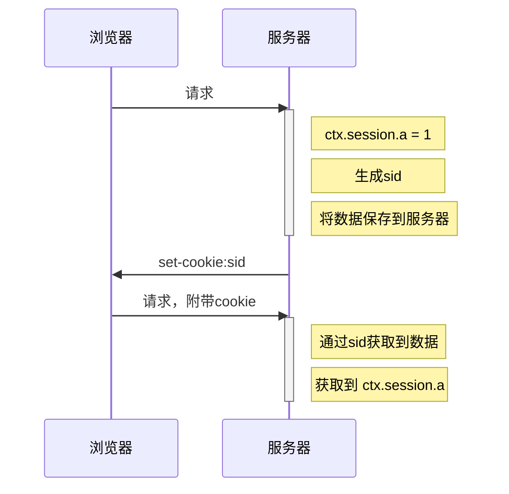
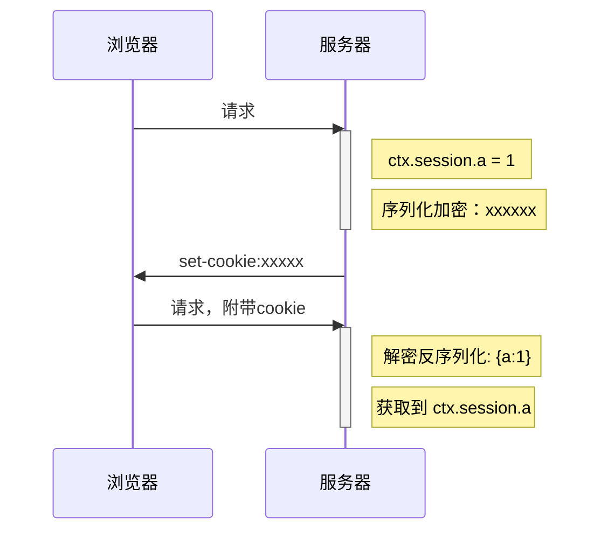

> egg 在内部使用 `egg-session` 插件完成session功能，`egg-session`插件在内部使用`koa-session`完成session功能

# 使用session

```js
ctx.session.prop = value;
```

注意点：

- 设置的属性不能以`_`开头
- 属性名不能为`isNew`
- 具体原因见`koa-session`源码：https://github.com/koajs/session/blob/master/lib/session.js

# 原理

`koa-session`和普通session不同，它在默认情况下，是将session中保存的数据序列化后加密保存到客户端的`cookie`中


传统的`session`处理模式




`egg-session`的处理模式



# 配置

```js
exports.session = {
  key: 'EGG_SESS', // cookie的键
  maxAge: 24 * 3600 * 1000, // cookie的过期时间
  httpOnly: true, // 该cookie是否仅允许http传输，不允许js获取
  encrypt: true, // 该cookie的内容是否要加密
  renew: false, // 是否每次请求后进一步延长cookie的过期时间
};
```


虽然不推荐，不过你可以将这种session模式转换为传统模式，只需要设置session的存储模式即可

```js
// app.js
module.exports = app => {
  // 自定义session存储模式
  app.sessionStore = {
    // 根据指定的键得到对应的session值
    async get (key) {
      // return value;
    },
    // 根据指定的键、值、过期时间（毫秒），设置session
    async set (key, value, maxAge) {
      
    },
    // 摧毁session调用的方法
    async destroy (key) {
      // destroy key
    },
  };
};
```

你也可以直接使用插件`egg-session-redis`，安装后，启用它即可

**注意：一旦选择了将 Session 存入到外部存储中，就意味着系统将强依赖于这个外部存储，当它挂了的时候，我们就完全无法使用 Session 相关的功能了。因此我们更推荐大家只将必要的信息存储在 Session 中，保持 Session 的精简并使用默认的 Cookie 存储，用户级别的缓存不要存储在 Session 中。**

