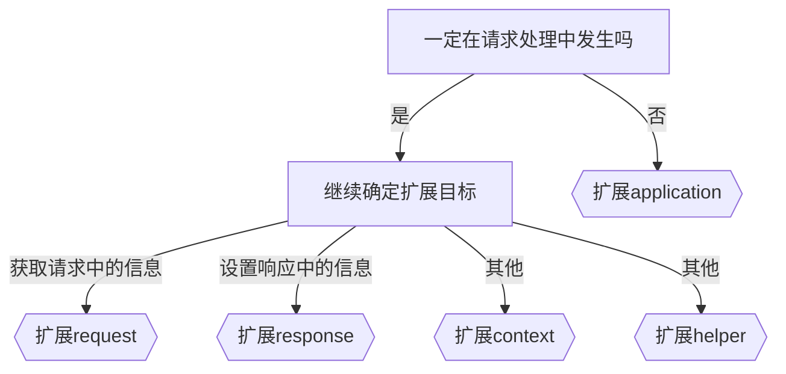

- application， `extend/application.js`
- context， `extend/context.js`
- request，`extend/request.js`
- response，`extend/response.js`
- helper，`extend/helper.js`

# 扩展决策树

```mermaid
graph TD
opInContext[一定在请求处理中发生吗]
opOfContext[继续确定扩展目标]
setInRequest{{扩展request}}
setInResponse{{扩展response}}
setInContext{{扩展context}}
setInHelper{{扩展helper}}
setInApplication{{扩展application}}
opInContext-->|是|opOfContext
opOfContext-->|获取请求中的信息|setInRequest
opOfContext-->|设置响应中的信息|setInResponse
opOfContext-->|其他|setInContext
opOfContext-->|其他|setInHelper
opInContext-->|否|setInApplication
```

