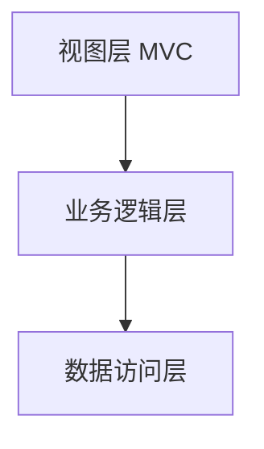

# 三层架构 + MVC

# 在egg中使用数据库

egg支持多种方式操作数据库：

- mysql：https://eggjs.org/zh-cn/tutorials/mysql.html
- sequelize：https://eggjs.org/zh-cn/tutorials/sequelize.html
- mongoose：https://github.com/eggjs/egg-mongoose
- redis：https://github.com/eggjs/egg-redis

