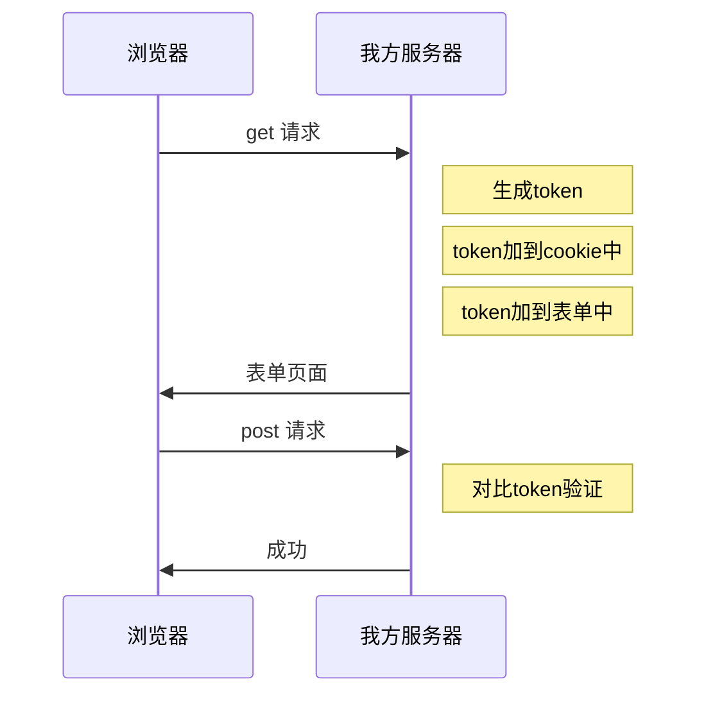
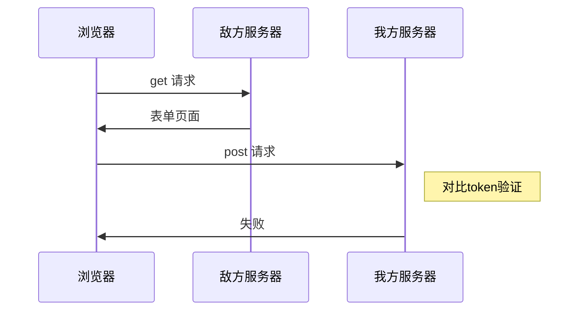

`egg`内部开启了`egg-security`插件，用于提供一套成熟的安全实践

# xss 防护

`egg-security`在`helper`中扩展了一些方法，用于`xss`防护

1. `helper.escape`，该方法会对整个字符串进行XSS过滤，转换目标字符串中的危险字符

   ```js
   const str = '<a href="/">XSS</a><script>alert("abc") </script>';
   console.log(ctx.helper.escape(str));
   // => &lt;a href=&quot;/&quot;&gt;XSS&lt;/a&gt;&lt;script&gt;alert(&quot;abc&quot;) &lt;/script&gt;
   ```

   这对在页面中显示用户字符很有用

2. `helper.sjs`，该方法会将字符串中进行JS Encode，将某些特殊字符，转换为十六进制的编码形式`\x编码`

   ```js
   const foo = '"hello"';
   
   // 未使用 sjs
   console.log(`var foo = "${foo}";`);
   // => var foo = ""hello"";
   
   // 使用 sjs
   console.log(`var foo = "${ctx.helper.sjs(foo)}";`);
   // => var foo = "\\x22hello\\x22";
   ```

   这对在JS中动态加入用户字符很有用

3. `helper.shtml`，过滤一段`html`字符串

   ```js
   const value = `<a t=1 title="a" href="http://www.domain.com">google</a><script>evilcode…</script>`;
   console.log(ctx.helper.shtml(value));
   // => <a title="a">google</a>&lt;script&gt;evilcode…&lt;/script&gt;
   ```

   可见，对于某些标签和属性，是可以保留的，这取决于白名单的设置，而对于白名单之外的标签和属性，不会保留或者进行编码处理

   另外，针对某些元素的链接，可以配置域名白名单

   ```js
   // config/config.default.js
   
   
   exports.helper = {
     shtml: {
       whiteList: { a: ["title", "href"] }, // 配置shtml的白名单
       domainWhiteList: ["www.domain.com"], // 配置shtml的域名白名单
     },
   };
   ```

   注意 shtml 的适用场景，一般是针对来自用户的富文本输入，切忌滥用。 此类场景一般是论坛、评论系统等，即便是论坛等如果不支持 HTML 内容输入，也不要使用此 Helper，直接使用 `escape` 即可。


# csrf 防护

`egg-security`选择的是使用`csrf token`进行 csrf 防护

原理：



如何防护：



egg提供了`ctx.csrf`来获取可以与`cookie`匹配的token

在下次请求时，仅需将该token放置到`query`或`body`中的`_csrf`字段即可，例如

```ejs
<!-- 放置到 query 中 -->
<form action="?_csrf=<%=ctx.csrf %>" method="POST">
  ...
</form>

<!-- 放置到 body 中 -->
<form action="" method="POST">
  <input type="hidden" name="_csrf" value="<%=ctx.csrf %>">
  ...
</form>
```

对于`ajax`请求，可以直接在js中获取到`cookie`中的`token`，放置到`body`或`query`即可

也可以针对字段名进行配置

```js
// config/config.default.js
exports.security = {
  csrf: {
    cookieName: 'csrfToken', // Cookie 中的字段名，默认为 csrfToken
    bodyName: "_csrf",
    queryName: "_csrf"
  },
};
```

由于`egg-security`制作了中间件，因此，对于security中的配置，可以使用中间件的模式，即是说，下面的配置同样适用：

- match
- ignore
- enable