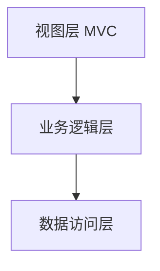

# 三层架构 + MVC



理论梳理：

**在服务端使用`MVC`模式，是为了降低服务端渲染的复杂度**

**在服务端使用三层架构，是为了降低整个系统的复杂度**


# 在egg中处理业务逻辑

egg提供了一套标准化的流程，用于搭建业务逻辑层

## 创建service

```js
// app/service/local.js
const Service = require('egg').Service;

class LocalService extends Service {
  async getProvinces() {
    const resp = await this.app.axios.get(`${this.config.$apiBase}/api/local`);
    return resp.data;
  }
}

module.exports = LocalService;
```

- service模块必须放到`app/service`目录中
- service模块必须导出一个继承自`Service`的类
- egg会在**每次请求**到达后创建该类的实例
- 父类`Service`中包含了下面的属性：
  - `this.ctx`
  - `this.app`
  - `this.config`

## 使用service

每次请求到达后，egg会实例化所有的Service，并保存到`context.service`中

举个栗子

```
|-app
	|-service
		|-sub
			|-t1.js
	 - t2.js
	 - t3.js
```

上面的目录结构定义了3个service，因此，你可以在`ctx`中通过下面的方式获取它们的实例

```js
ctx.service.sub.t1
ctx.service.t2
ctx.service.t3
```

具体的实例

```js
// app/controller/home.js
const Controller = require("egg").Controller;

module.exports = class extends Controller {
  async index() {
    const provinces = await this.ctx.service.local.getProvinces();
    var model = {
      title: "首页",
      provinces
    };
    await this.ctx.render("home", model);
  }
};
```

> 不仅仅在controller中可以使用service，在service中也可以通过 `thix.ctx.service` 获取其他的service

为了让使用更加方便，egg定义了别名，在controller和service中均可以使用下面的方式更加简单的获取

```js
this.service
```

